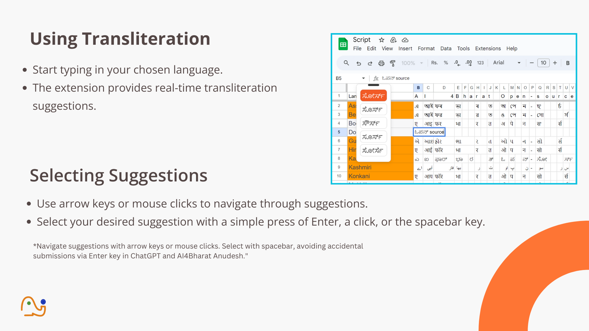
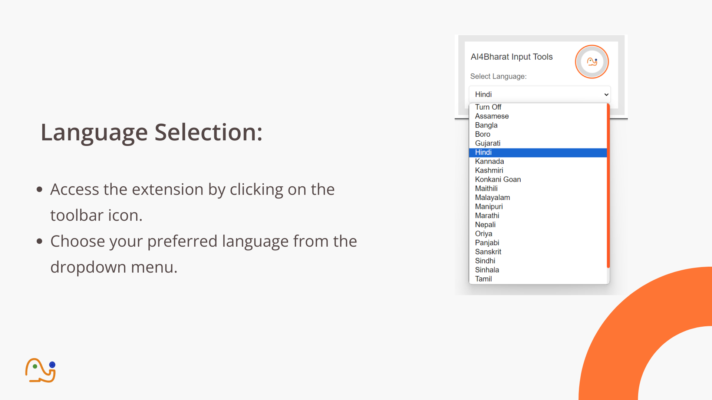
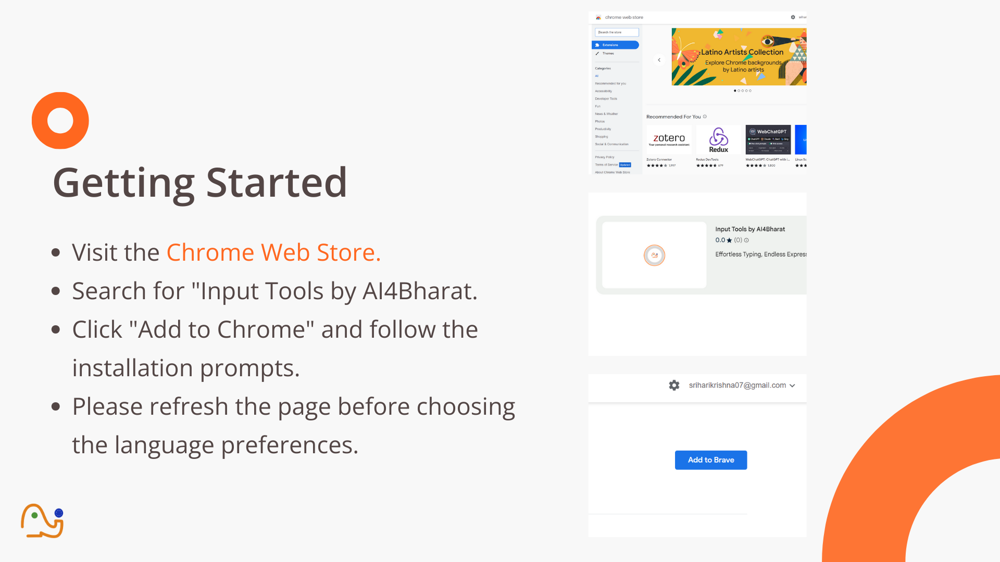
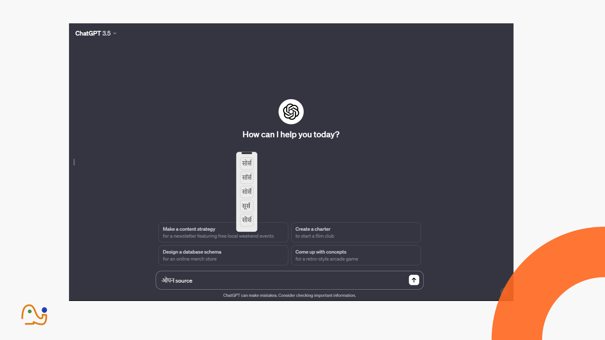
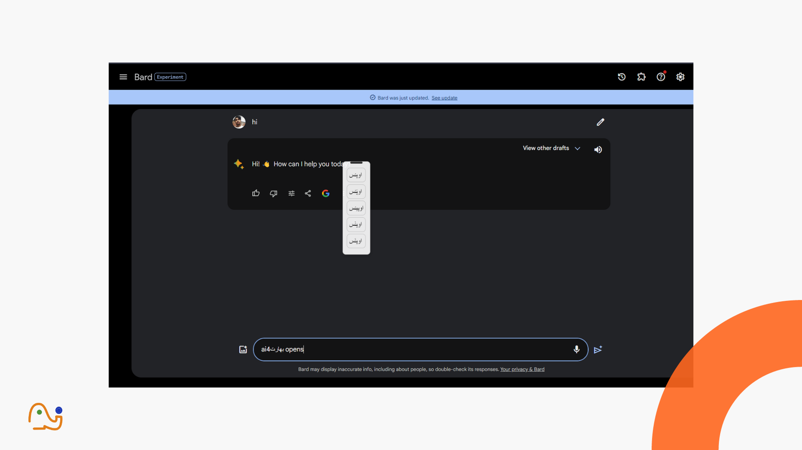
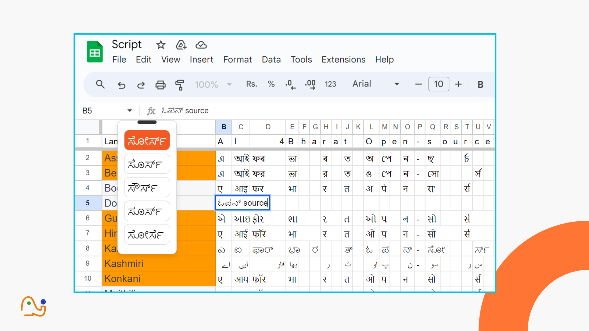

# AI4Bharat's Input Tools Chrome Extension

Enhance your multilingual typing experience in Chrome with AI4Bharat's Input Tools extension. This extension provides real-time transliteration suggestions for Indian languages, making it easier to type in your preferred language seamlessly.

   

## Features

- **Real-time Transliteration Suggestions:** Receive suggestions as you type in Indian languages.
- **Element Support:** Works with contenteditable, input:text, and textarea elements.
- **Draggable Suggestion Box:** Improved user interaction with a draggable suggestion box.
- **Multilingual Support:** Covers a diverse range of Indian languages.

## Seamless Multilingual Typing Across Platforms

Experience effortless multilingual typing with AI4Bharat's Input Tools Chrome Extension across various platforms.

- **ChatGPT:** Type effortlessly in your preferred Indian language while chatting.
- **BARD (Blog Authoring & Research Dashboard):** Simplify content creation in Indian languages.
- **Gmail:** Compose emails effortlessly with real-time transliteration suggestions.
- **Google Sheets:** Streamline data entry in Indian languages.

---

*Happy Typing!*

## Installation

1. Clone this repository or download the ZIP file.
2. Open Chrome and go to `chrome://extensions/`.
3. Enable "Developer mode" in the top right.
4. Click on "Load unpacked" and select the extension directory.
5. **Reload the page** to activate the extension.

## Usage

1. Open a webpage with a text input field.
2. Start typing in your preferred language.
3. Receive real-time transliteration suggestions.
4. Select a suggestion to insert it into your text.

## Configuration

The extension allows you to configure the target language for transliteration. Follow these steps:

1. Click on the extension icon in the Chrome toolbar.
2. Choose your preferred language from the options.
3. Save your changes.

## Contributing

Contributions are welcome! If you encounter any issues or have suggestions for improvement, feel free to open an issue or submit a pull request.

## Download from Chrome Web Store

Get the extension directly from the [Chrome Web Store](https://chromewebstore.google.com/detail/input-tools-by-ai4bharat/lofelgaafdbdikholfnckfgigjklghik).

---
“ A Digital Frontier Where Every Keystroke Writes Tomorrow's History."

*Happy Typing!*
